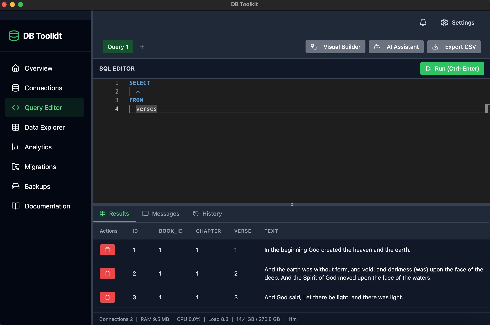

# DB Toolkit

   

A modern, cross-platform desktop database management application built with **Electron + React** frontend and **Node.js** backend.

## Features

- **Workspaces** - Multiple isolated workspace tabs (up to 20) for working with different databases simultaneously, with custom names, colors and keyboard shortcuts
- **Multi-Database Support** - PostgreSQL, MySQL, SQLite, MongoDB with connection management and session persistence
- **Schema Explorer** - Visual tree browser with table details, search, and real-time updates
- **Query Editor** - Monaco-based editor with syntax highlighting, auto-complete, multiple tabs, history, and AI-powered analysis
- **Data Explorer** - Inline editing, insert/delete rows, pagination, sorting, filtering, CSV/JSON export/import, and cell preview
- **Backup & Restore** - Automated and manual backups with scheduling, compression, verification, and real-time progress
- **AI Query Assistant** - Generate, optimize, and explain SQL queries with Cloudflare AI
- **Settings & Customization** - Dark mode, query defaults, editor preferences, workspace settings, and appearance settings

## Tech Stack

**Backend:** Node.js, Electron IPC, SQLite3, PostgreSQL, MySQL, MongoDB drivers  
**Frontend:** Electron, React 18, Tailwind CSS, Monaco Editor, Framer Motion, Vite

## License

MIT License